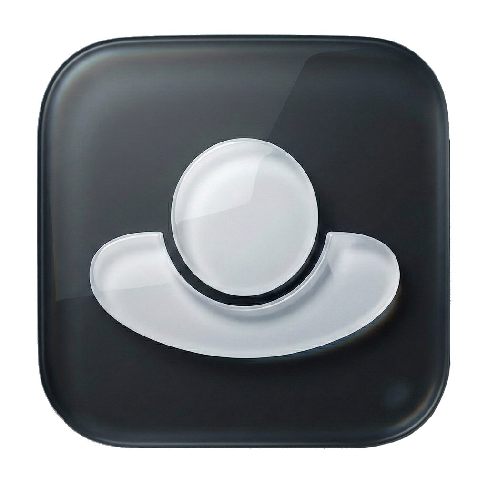

<p align="center">
  
</p>

<h1 align="center">Studio Guide</h1>

<p align="center">
  <strong>Real-time AI-powered camera tracking & on-screen talent guidance for studio environments</strong>
</p>

<p align="center">
  <a href="#features">Features</a> •
  <a href="#demo">Demo</a> •
  <a href="#architecture">Architecture</a> •
  <a href="#getting-started">Getting Started</a> •
  <a href="#tech-stack">Tech Stack</a> •
  <a href="#configuration">Configuration</a>
</p>

---

## Demo

<p align="center">
  <video width="100%" controls src="https://github.com/user-attachments/assets/8d813e99-3ad8-4d48-a455-9a9ea5d534cb">
  </video>
</p>

---

## What is Studio Guide?

Studio Guide is a desktop application that uses **real-time face and hand tracking** to guide on-camera talent into the optimal position within the camera frame. Built for broadcast studios, content creators, and live production environments where precise framing matters.

It tracks up to **4 faces simultaneously** at **60 FPS** using MediaPipe's ML models running entirely on-device — no cloud, no latency, no privacy concerns.

---

## Features

<table>
  <tr>
    <td width="50%">
      <h3>🎯 Smart Zone Guidance</h3>
      <p>Define a 3D "safe zone" with configurable depth and width boundaries. Talent receives real-time directional guidance — <em>step closer, step back, step left, step right</em> — to stay perfectly framed.</p>
    </td>
    <td width="50%">
      <h3>👤 Multi-Face Tracking</h3>
      <p>Track up to 4 faces with 478 3D landmarks each, including yaw, pitch, roll, and depth estimation. Multi-tier detection fallback ensures faces are never lost.</p>
    </td>
  </tr>
  <tr>
    <td width="50%">
      <h3>✋ Gesture Recognition</h3>
      <p>Recognizes 8 gesture types (fist, palm, thumbs up/down, victory, pointing, and more) and maps them to studio actions like start/stop recording or playback.</p>
    </td>
    <td width="50%">
      <h3>🗺️ 3D Top-Down Map</h3>
      <p>WebGL-rendered bird's-eye view showing tracked faces positioned in real 3D space relative to the camera, powered by Three.js and React Three Fiber.</p>
    </td>
  </tr>
  <tr>
    <td width="50%">
      <h3>🖥️ Multi-Display Support</h3>
      <p>Toggle a secondary output window on any connected monitor — perfect for talent-facing displays or control room monitors.</p>
    </td>
    <td width="50%">
      <h3>📧 Smart Alerts</h3>
      <p>Automatic email notifications on camera connect/disconnect events with customizable HTML templates and configurable endpoints.</p>
    </td>
  </tr>
  <tr>
    <td width="50%">
      <h3>🔌 Companion Integration</h3>
      <p>Connects to external automation systems like Bitfocus Companion for recording and playback status, with variable message support.</p>
    </td>
    <td width="50%">
      <h3>📷 Auto Camera Recovery</h3>
      <p>Detects USB webcam disconnections and automatically reconnects when the device reappears — zero manual intervention needed.</p>
    </td>
  </tr>
</table>

---

## Architecture

```
┌─────────────────────────────────────────────────────────┐
│  Electron Main Process                                  │
│  Window management · Config persistence · Logging       │
│  Email relay · Multi-display orchestration              │
├─────────────────────────────────────────────────────────┤
│  Preload Bridge (Context Isolation)                     │
│  Secure IPC: tracking data, config, alerts, hardware    │
├─────────────────────────────────────────────────────────┤
│  React Frontend (Vite)                                  │
│                                                         │
│  ┌─────────────┐  ┌──────────────┐  ┌───────────────┐  │
│  │  Contexts    │  │  Services     │  │  Web Worker   │  │
│  │             │  │              │  │               │  │
│  │ Config      │  │ Tracking     │  │ MediaPipe     │  │
│  │ Tracking    │  │ Service      │  │ WASM Runtime  │  │
│  │ Hardware    │  │              │  │               │  │
│  │ UI          │  │ Alert        │  │ Face Detect   │  │
│  │             │  │ Service      │  │ Landmarks     │  │
│  └─────────────┘  └──────────────┘  │ Gestures      │  │
│                                      └───────────────┘  │
│  ┌──────────────────────────────────────────────────┐   │
│  │  Admin Dashboard (4-Card Grid)                    │   │
│  │  ┌─────────────┐  ┌─────────────┐                │   │
│  │  │ Face Tracker │  │ Top-Down Map│                │   │
│  │  │  + Overlays  │  │   (WebGL)   │                │   │
│  │  ├─────────────┤  ├─────────────┤                │   │
│  │  │  Trigger    │  │    Zone     │                │   │
│  │  │  Status     │  │  Settings   │                │   │
│  │  └─────────────┘  └─────────────┘                │   │
│  └──────────────────────────────────────────────────┘   │
└─────────────────────────────────────────────────────────┘
```

### Performance Design

- **Zero-Copy Buffer Protocol** — Tracking data is serialized into flat `Float32Array` buffers with a defined binary layout, avoiding JSON overhead at 60 FPS
- **Web Worker Isolation** — All ML inference runs off the main thread for smooth UI rendering
- **Multi-Tier Detection Fallback** — Progressive face recovery strategy (standard → center-crop → sniper-crop → offscreen scout) for robust tracking

---

## Getting Started

### Prerequisites

- **Node.js** 18+
- **npm** 9+
- A webcam

### Installation

```bash
# Clone the repository
git clone https://github.com/mitchschoolvic/Studio-Guide.git
cd guideapp_electron/studio-guide

# Install main process dependencies
npm install

# Install frontend dependencies
cd frontend && npm install && cd ..
```

### Development

```bash
# Start both the frontend dev server and Electron app
./start_app.sh
```

Or manually:

```bash
# Terminal 1 — Start the Vite dev server
cd frontend && npm run dev

# Terminal 2 — Build and launch Electron
npm start
```

### Production Build

```bash
# Build the frontend
cd frontend && npm run build

# Build the Electron main process
npm run build
```

---

## Tech Stack

| Layer | Technology |
|:---|:---|
| **Desktop Shell** | Electron 28 |
| **Frontend** | React 19 + TypeScript 5.9 + Vite |
| **3D Rendering** | Three.js via @react-three/fiber |
| **AI / Vision** | MediaPipe WASM (Face Landmarker, BlazeFace, Gesture Recognizer) |
| **State** | React Context API (4 providers) |
| **IPC** | Electron preload bridge with context isolation |
| **Data Transport** | Zero-copy ArrayBuffer protocol |

---

## Configuration

Studio Guide stores its configuration as a JSON file managed through the in-app settings panel. Key configurable options:

| Setting | Description |
|:---|:---|
| **Safe Zone Depth** | Near/far boundaries in millimeters |
| **Safe Zone Width** | Horizontal boundary as percentage of frame |
| **Max Faces** | Number of faces to track simultaneously (1–4) |
| **Head Width** | Reference head width in mm for depth calibration |
| **Gesture Actions** | Map gestures to recording/playback triggers |
| **Email Alerts** | Endpoint URLs and templates for camera status notifications |
| **Companion** | External automation system connection settings |

---

## Project Structure

```
Studio-Guide/
├── src/                    # Electron main process
│   ├── main/               #   App lifecycle, windows, IPC, logging
│   ├── preload/            #   Secure context bridge
│   └── shared/             #   Shared types & constants
├── frontend/               # React frontend (Vite)
│   ├── src/
│   │   ├── components/     #   UI components & overlays
│   │   ├── contexts/       #   React context providers
│   │   ├── hooks/          #   Custom React hooks
│   │   ├── layouts/        #   Page layouts (Admin, Secondary)
│   │   ├── services/       #   Tracking & alert services
│   │   ├── lib/            #   Math & tracking utilities
│   │   ├── types/          #   TypeScript schemas & types
│   │   └── workers/        #   Web Worker (MediaPipe inference)
│   └── public/
│       ├── models/         #   MediaPipe ML model files
│       └── wasm/           #   MediaPipe WASM runtime
└── release_builds/         # Packaged .dmg installers
```

---

## License

This project is proprietary software. All rights reserved.

---

<p align="center">
  Built with ❤️ for studio production environments
</p>
